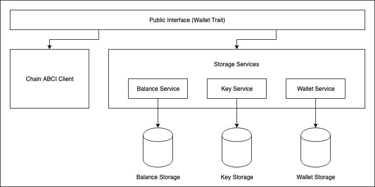

# Crypto.com Chain Client

This crate exposes following functionalities for interacting with Crypto.com Chain:
- Wallet creation
- Address generation
- Transaction syncing and storage
- Balance tracking
- Transaction creation and signing

## Design

Below is a high level design diagram of this crate:

    

### `Storage` trait

This trait declares APIs for different database operations such as `clear`, `get`, `set`, `contains_key`, etc. This 
crate provides a default implementation (`SledStorage`) of this trait using `Sled` embedded database.

### `SecureStorage` trait

This trait exposes APIs for securely getting and setting values in `Storage`. This crates is automatically implemented
for all the types implementing `Storage` trait.

### `Chain` trait

This trait exposes APIs for communicating with Crypto.com Chain via ABCI. Currently, this crate exposes following APIs:
- `query_transaction_changes`: Queries Crypto.com chain for balance changes for different `addresses` from
  `last_block_height`.

### Services

`Storage` implementation provide generic APIs over any storage backend. In order to provide intended public interface
(`Wallet`) through this crate, we need specific services for handling storage of different entities, like, keys, 
wallets, balance, and transactions.

#### `KeyService`

`KeyService` exposes key related operations (`generate` and `get_keys`) on top of any `Storage` implementation.
- `generate`: Generates a new private key for given `wallet_id` and encrypts it with given `passphrase` before storing.
- `get_keys`: Returns all the keys stored for given `wallet_id` and decrypts them with given `passphrase`.

#### `WalletService`

`WalletService` exposes wallet related operations (`create` and `get`) on top of any `Storage` implementation.
- `create`: Creates a new wallet and returns `wallet_id`. This function also encrypts all the data using `passphrase`
   before storing it in `Storage`.
- `get`: Retrieves a `wallet_id` from `Storage` and decrypts it with given `passphrase`.

#### `BalanceService`

`BalanceService` exposes balance related operations (`sync`, `sync_all` and `get_balance`) on top of any `Storage` and
`Chain` implementation.
- `sync`: Updates balance for given `wallet_id` and `addresses` after querying new transactions from Crypto.com Chain. 
  This function first retrieves current `balance` and `last_block_height` from `Storage` and then queries `Chain` for 
  any updates since `last_block_height`. After successful query, it updates the data in `Storage`.
- `sync_all`: This works in similar way as `sync` except it sets `last_block_height = 0` and queries for all the
  transactions since genesis block.
- `get_balance`: Returns balance for a given `wallet_id` from `Storage`.

### `Wallet` trait

Crypto.com exposes public interface through `Wallet` trait which contains following functions with default 
implementations: 

- `new_wallet`: Creates a new wallet with given `name` and encrypts it with given `passphrase`. This function internally
  calls `crate` function of `WalletService`. 
- `get_public_keys`: Retrieves all public keys corresponding to given wallet `name` and `passphrase`. This function
  internally uses `KeyService` for get this information.
- `get_addresses`: Retrieves all addresses corresponding to given wallet `name` and `passphrase`. This function 
  internally uses `KeyService` for get this information.
- `generate_public_key`: Generates a new public key for given wallet `name` and `passphrase`. This function internally
  uses `KeyService`.
- `generate_address`: Generates a new address (redeem) for given wallet `name` and `passphrase`. This function 
  internally uses `KeyService`.
- `get_balance`: Retrieves current balance for given wallet `name` and `passphrase`. This function internally uses
  `BalanceService` to get the balance.
- `sync_balance`: Synchronizes and returns current balance for given wallet `name` and `passphrase`. This function
  internally uses `BalanceService::sync` to synchronize balance.
- `recalculate_balance`: Recalculate current balance for given wallet `name` and `passphrase` from genesis. This 
  function internally uses `BalanceService::sync_all` to synchronize balance.

### Warning

This is a work-in-progress crate and is unusable in its current state. These is no implementation for Chain ABCI client
(`Chain` trait) as of now.
