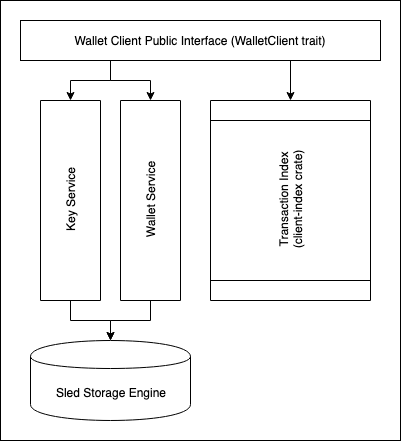

# Crypto.com Chain Client (client-core)

This crate provides `WalletClient` trait which is responsible for interacting with transaction index and provide
following functionalities on per-wallet basis:

- Wallet creation
- Address generation
- Balance tracking
- Transaction history
- Transaction creation and signing (with automatic unspent transaction selection)

## Design

Below is a high level design diagram of this crate:

<div class = "design_diagram">
    
</div>

### `WalletClient` trait

This trait declares APIs for accessing various functionalities for a wallet:

- Wallet creation and retrieval: `new_wallet()` and `wallets()` functions.
- Address generation and retrieval: `new_address()` and `addresses()` functions.
- Balance tracking: `balance()` function.
- Transaction history: `history()` function.
- Transaction creation and signing: `create_and_broadcast_transaction()` function. This function also handles automatic
unspent transaction selection.

Besides above functions, `WalletClient` also exposes `sync()` and `sync_all()` functions which are used to synchronize
transaction index with Crypto.com Chain. This synchronization mechanism is subject to change. Currently, a default 
implementation (`DefaultWalletClient`) of `WalletClient` is provided.

### Services

`WalletClient` exposes a public interface for interacting with a **wallet**. In order to provide these capabilities, 
`DefaultWallet` delegates storage of each type of entity to its own _Service_. Currently, there are
following services:

#### `KeyService`

`KeyService` exposes key related operations (`generate` and `get_keys`) on top of any `Storage` implementation.
- `generate`: Generates a new private key for given `wallet_id` and encrypts it with given `passphrase` before storing.
- `get_keys`: Returns all the keys stored for given `wallet_id` and decrypts them with given `passphrase`.

#### `WalletService`

`WalletService` exposes wallet related operations (`create` and `get`) on top of any `Storage` implementation.
- `create`: Creates a new wallet and returns `wallet_id`. This function also encrypts all the data using `passphrase`
   before storing it in `Storage`.
- `get`: Retrieves a `wallet_id` from `Storage` and decrypts it with given `passphrase`.

## API Documentation

To see this crate's API docs. Run following command from `chain` directory.
```
cargo doc --package client-core --no-deps --open
```
