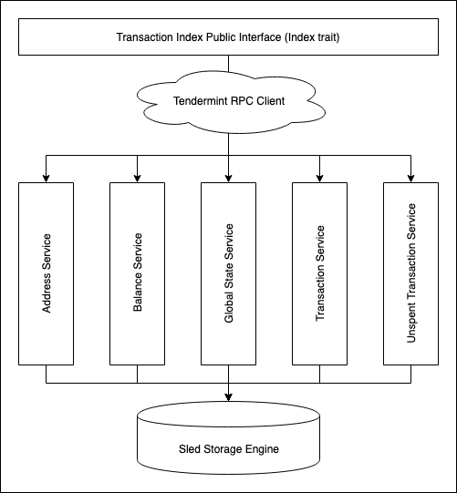

# Crypto.com Chain Client (client-index)

This crate provides `Index` trait which is responsible for synchronizing with _Crypto.com Chain_ and indexing `block`
data in a format which can easily be used to provide additional functionalities like balance tracking, transaction
history, unspent transaction tracking, etc. by client.

## Design

Below is a high level design diagram of this crate:

<div class = "design_diagram">
    
</div>

### `Index` trait

This trait declares APIs for querying different entities from **transaction index**:
- `transaction_changes`: Returns all transaction changes for given address
- `balance`: Returns current balance for given address
- `transaction`: Returns transaction with given id

This trait also declares API, `broadcast_transaction`, for broadcasting a transaction to Crypto.com Chain. Currently,
a default implementation (`DefaultIndex`) of `Index` is provided.

### Services

`Index` exposes a public interface for querying any entity from transaction index. In order to provide these querying
capabilities, `DefaultIndex` delegates indexing of each type of entity to its own _Service_. Currently, there are
following services:

- Address Service: Stores a mapping of `address` to a list of `TransactionChange` (`address -> [TransactionChange]`).
- Balance Service: Stores current balance for all addresses.
- Global State Service: Stores `last_block_height` which is used to synchronize with Crypto.com Chain from last known
height.
- Transaction Service: Stores all the successful transaction which can be queried by their `id`s.
- Unspent Transaction Service: Stores unspent transactions for an address. This is mainly used for creating new
transactions.

## API Documentation

To see this crate's API docs. Run following command from `chain` directory.
```
cargo doc --package client-index --no-deps --open
```
